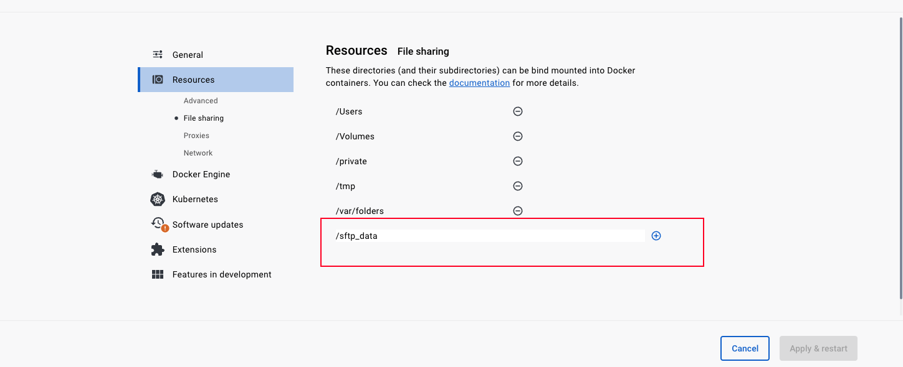
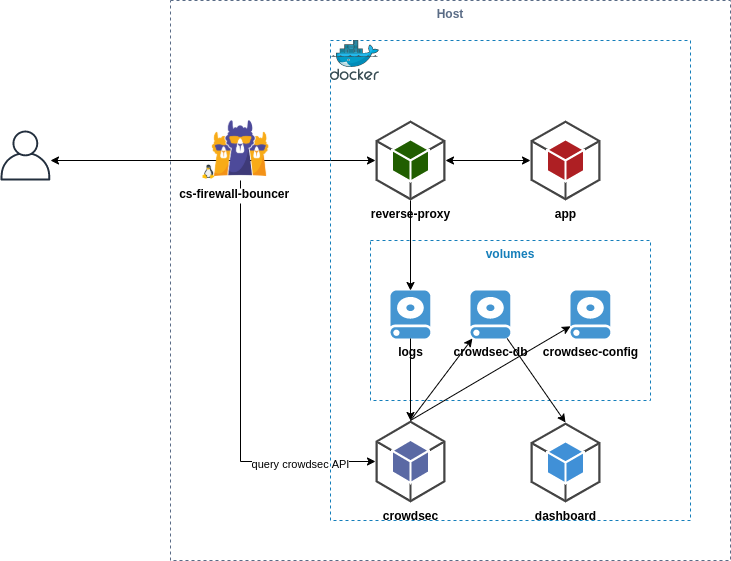

# Standalone SSH/SFTP Server Secured With Crowdsec on Docker Environment

**Prerequisites:** [Docker](https://docs.docker.com/engine/install/) / [Docker Compose](https://docs.docker.com/compose/install/)

This is a standalone SSH/SFTP server secured with Crowdsec IP Tables based firewall. It detects and blocks IP addresses that is unauthorized. 
With the current configuration default user is limited for only SFTP connection however it can be changed by modifying the SSH Server settings
file under **'sshd_config' under **ssh-server folder: Take a look line #57 to #59. Default user is jailed to **'sftp_data' folder which has to be 
located in the root of docker host.

## Here are the installation steps
1. Install Docker engine to your host machine. (Can't explain how to do that because it is a long story Google it!)
2. Goto Docker engine settings/resources and add relevant resources. Otherwise you will have some permission issues when mapping docker volumes (Take a look volumes sections in the **docker-compose-.yaml**) refer this image: 
3. Create a folder **sftp_data** in the docker host machine.
4. cd into **ssh-server/keys folder and create public and private key with following command:
   **ssh-keygen -b 4096 -f id_rsa_for_sshu1
5. Rename **.env.example** file to **.env**
6. Add a desired user name and a complex password (required)
7. Goto https://app.crowdsec.net/ and enroll for the console (you can subscribe some some of the free and paid block-lists, and also manually block some IP addresses that attacks your SSH server  Take a look their documentation at their website ). Put your ENROLL_KEY to your .env file
9. Set the PASSWORD_ACCESS=false (we want public key authentication for a better security)
10. And finally docker-compose up -d
11. You should be able to access your SFTP server instance with an FTP client
12. If not try to tail into container logs, and solve the mysterious problems
    - sudo docker logs --tail 50 --follow --timestamps sshsrv
    - sudo docker logs --tail 50 --follow --timestamps crowdsec 

 > If you can't get it work try to understand the analogy in this picture 
    

This example explains how to integrate Crowdsec in environment deployed with docker-compose. It set up multiple containers :

This example contains multiple containers :
* app : apache server serving index.html containing an `hello world`
* reverse-proxy : nginx that serving this app from the host
* crowdsec : it will read reverse-proxy logs from the shared volume
* dashboard : we use [metabase](https://hub.docker.com/r/metabase/metabase) to display crowdsec database data.

We have chosen the simplest way to collect logs (by sharing volumes between containers), if you are in production, you are probably using [logging-driver](https://docs.docker.com/config/containers/logging/configure/) to centralize logs with rsyslog or another driver, so don't forget to adapt the crowdsec docker-compose configuration to read your logs properly.

ps: default's credentials for metabase are `crowdsec@crowdsec.net` and `!!Cr0wdS3c_M3t4b4s3??`
